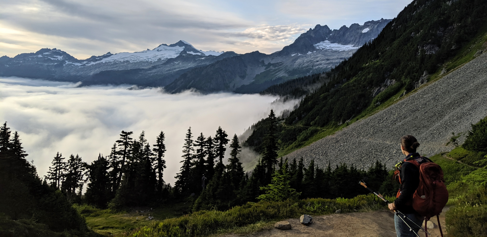

 ---
title: "About the Author"
showdate: False
slug: /about/
---

>If quarantine brought me one gift, my once three-hour commute became three hours each day to build a portfolio and digress on some of the more interesting topics in statistics. This of course, comes at the expense of turning the dining room into my new office. 

Hi, I'm Jes. 

I'm an institutional researcher with a background in Statistics and Data Science. In the office, my focus is on student equity through the use of data. I also love integrating Geographic Information Systems (GIS) as a visual and analytic aid in my work. Prior to institutional research, my work primarily focused on financial accounting and business administration. Outside of work, my projects are community-oriented and focus on voter advocacy and registration, community organization, and environmental awareness.  

### Beautiful, Ethical Data

My interest in statistics started after noticing a lot of confusion in how information was being shared. Projects, like annual reports made for the public, were often unclear. Ambiguity shows up in two forms: unethical data manipulation and poor visualization. 

There seems to be a general misunderstanding that science can tell data what to say. Answers are drafted before our models were ever designed. *"Have the data show..."* 

It's true that a single dataset can tell many different stories. Small shifts in how data are accessed, filtered, and modeled can change a narrative. This fact, however, can and will be problematic. We as statisticians minimize ambiguity through transparency in our choice of practices. 

Ambiguity is also what moves statistics away from pure mathematics. It's an applied field that borrows from both art and science. These fields are naturally complementary. Your presentation of data is useless if it lacks clarity. Simplifying visuals and creating some consistency are simple tactics to improve visualization. 

Simple mistakes and malicious manipulation alike can alter data into something unrecognizable. Having the tools and network to call out those transgressions is the first step, whereas my focus comes in teaching folks to see the issues in data visualization and manipulation for themselves. 

###  Plain-Language Statistics

There's a lot of power in simplifying statistical language to meet an audience at their level of understanding. I love watching faculty reach an "aha"-moment with their own information through Q&A discussions. Similarly, teaching young students the fundamentals of object-oriented programming has given me the opportunity to assess how well *I* know the fundamentals myself. With both parties, I'm learning as much from them as they are from me. 

### Out of Office

 

I've been lucky enough in the past several years be able to dedicate my time out of the office to exploring many of our public lands. My profile photo was taken on the rim of a cinder cone volcano in Lassen National Park. The photo above is of one of my favorite spots on the west coast. 

If I'm not in the state, I'm likely out exploring what the rest of the West has to offer. I'm looking forward to more days out of the house, out of the office, and in the backcountry.
